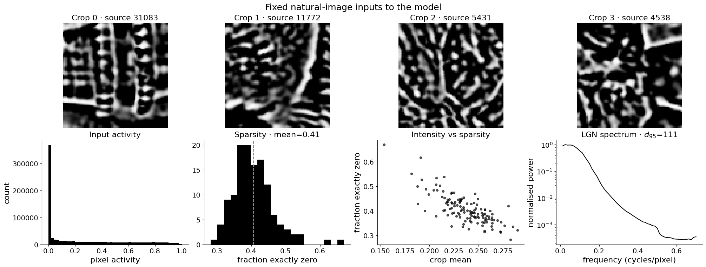
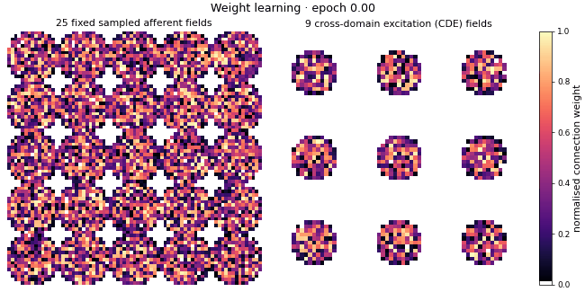
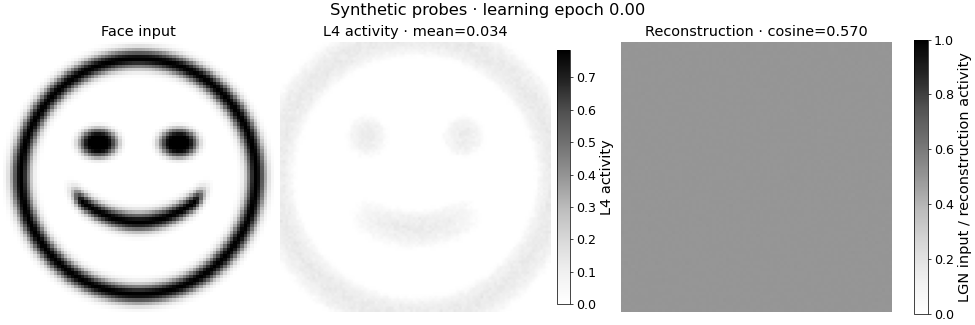
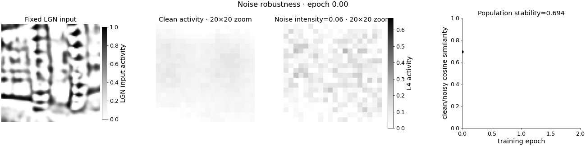
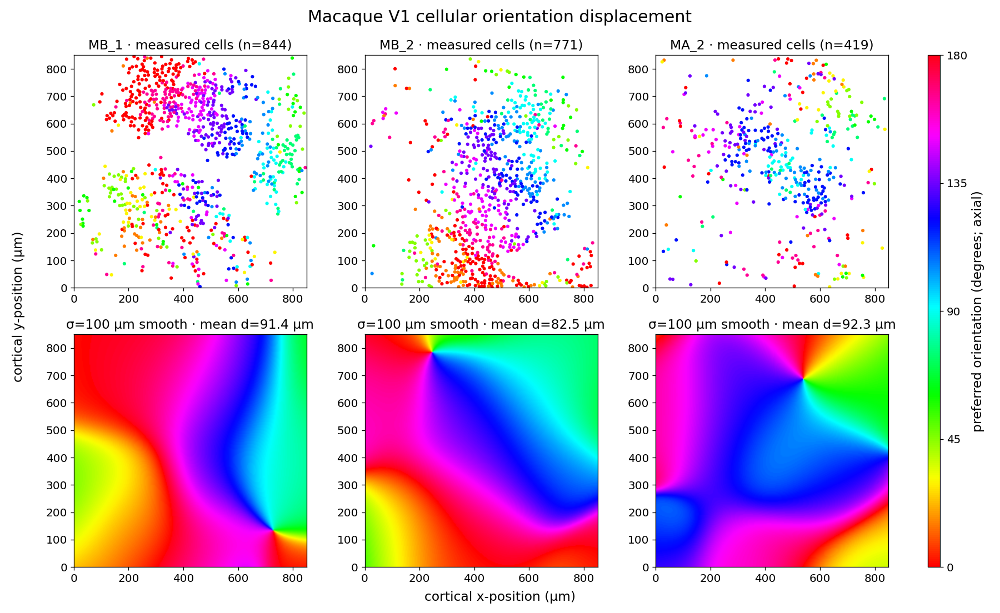
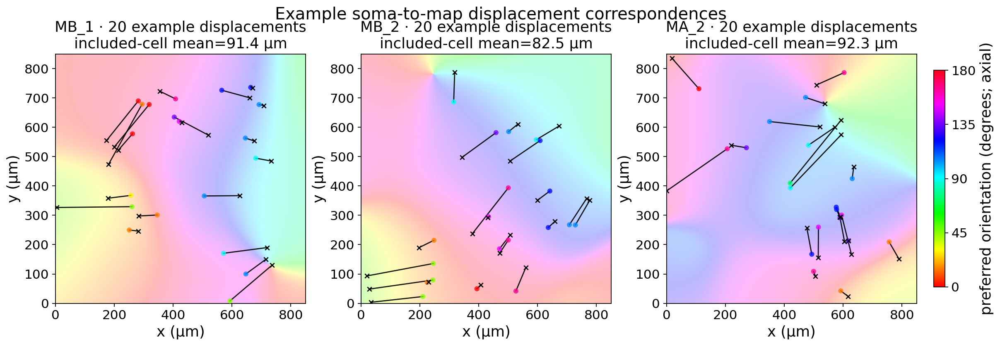
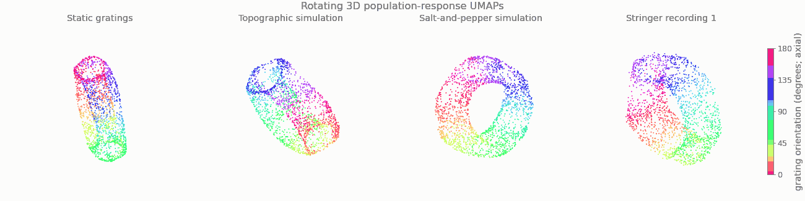

# Self-organisation of functional cortical maps without macroscopic spatial patterning — Preprint

Preprint by Nicola Mendini and Stuart P. Wilson.

This study uses a self-organising model of cortical map development to show how fine-scale, coupled functional domains can preserve coding properties and robust dynamics while becoming difficult to detect as a macroscopic spatial pattern. The results offer a model for how structured cortical self-organisation can appear salt-and-pepper at the cortical surface.

[Read the preprint](./self_organisation_without_macroscopic_patterning_preprint.pdf)

## Cortical microdomain self-organisation demo

**Can a seemingly random salt-and-pepper cortex be the product of
self-organisation?** The [complete demo notebook](./demo_microdomains/github_self_organisation_demo.ipynb)
follows a 100 × 100 V1 sheet through two epochs of natural-image learning and
suggests that the answer can be yes. The model builds an orderly fabric of
tiny, interconnected domains; modest neuronal displacement then hides its
large-scale spatial signature without destroying its functional structure.

The notebook develops this argument one step at a time. Every section starts
with a short narrative and places the corresponding technical explanation in
a collapsible block, so it can be read as either a visual story or a
reproducible modelling workflow. Reusable collection and plotting code lives
in the accompanying [`demo_microdomains`](./demo_microdomains/) folder.

### 1. Begin with sparse visual drive

Natural-image patches pass through an LGN-like contrast filter and gain
control. The cortex receives sparse edges and textures, with no orientation
labels telling it what sort of map to build.

  

### 2. Let tiny domains emerge

Recurrent settling and plasticity organise these inputs into many small
orientation domains. The Fourier ring reveals their preferred spacing, while
the retinotopic fishnet becomes locally distorted but remains globally
ordered.

  

At the same time, afferent receptive fields become selective and cross-domain
excitation learns which separated patches should cooperate. The domains are
small, but they are not independent.

  

### 3. Test whether the representation is useful

A fixed synthetic face makes reconstruction progress easy to see, while the
new final panel tracks average fidelity over the full held-out evaluation set.
The curve therefore measures the population code rather than the face alone.

  

PCA then reveals regular correlations across the sheet. The V1 code needs
fewer effective dimensions than its LGN input: the population has fewer
independent degrees of freedom, not merely fewer active neurons.

  

Finally, a matched perturbation at every snapshot shows that selective
recurrent interaction makes the settled representation increasingly stable
to injected noise.

  

### 4. Hide the map by moving neurons only a little

A mean displacement of only two model locations preserves short-range
clustering but erases the fine global periodicity. An orderly microdomain map
now looks salt-and-pepper by the usual spatial readouts—the same learned
network, but with a messier seating plan.

  

How plausible is that amount of scatter? Dense macaque V1 recordings provide
a rough estimate by comparing each measured soma with the nearest location
where a smoothed underlying orientation map predicts the same preference.

  

  

### 5. Look for the hidden order in response space

Displacement hides structure on the cortical sheet, but it does not scramble
the learned responses. Rotating UMAPs of gratings, topographic-model activity,
salt-and-pepper-model activity, and high-arousal mouse V1 data all show smooth,
folded response geometries. The model manifolds retain the angle–phase
organisation associated with the grating family's Klein-bottle structure.

  

### Take-home idea

Salt-and-pepper need not mean structureless. It may be the surface appearance
of self-organisation whose spatial footprint is too fine to survive modest
developmental displacement, even though selective connectivity, robust
dynamics, and an orderly population representation remain.
