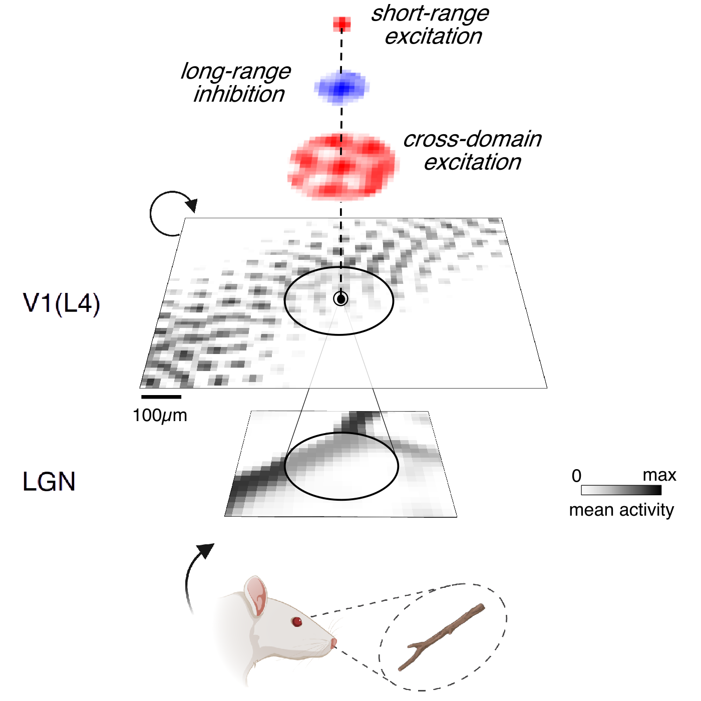

# Self-organisation of functional cortical maps without macroscopic spatial patterning — Preprint

Preprint by Nicola Mendini and Stuart P. Wilson.

This study uses a self-organising model of cortical map development to show how fine-scale, coupled functional domains can preserve coding properties and robust dynamics while becoming difficult to detect as a macroscopic spatial pattern. The results offer a model for how structured cortical self-organisation can appear salt-and-pepper at the cortical surface.

[Read the preprint](./self_organisation_without_macroscopic_patterning_preprint.pdf)

## Cortical microdomain self-organisation demo 🧠

**Can a seemingly random salt-and-pepper cortex be the product of
self-organisation?** The [complete demo notebook](./demo_microdomains/github_self_organisation_demo.ipynb)
starts from a slightly more playful version of the question: what if the map
is not missing, but hiding? 🧂 It follows a 100 × 100 V1 sheet through two
epochs of natural-image learning. The model builds an orderly fabric of tiny,
interconnected domains; modest neuronal displacement then makes that structure
look random without destroying what the network learned.

Reusable collection and plotting code lives
in the accompanying [`demo_microdomains`](./demo_microdomains/) folder.

### 1. Meet micro-GCAL: local competition, distant cooperation 🤝

Before the learning begins, let's introduce the model itself! Read it from
the bottom up: a visual stimulus is converted into sparse, contrast-normalised
activity in the **LGN**, which projects to a recurrent sheet representing
**V1 layer 4**.

  

Each cortical neuron combines four inputs:

- **Afferent input** from a small local LGN patch. Plastic afferent weights
  become the neuron's visual receptive field.
- **Short-range excitation (SRE)** from its nearest cortical neighbours. It
  lets nearby co-active neurons reinforce one another and settle as a local
  patch.
- **Longer-range inhibition (LRI)** from a wider surround. It creates
  competition, separates neighbouring patches, and prevents activity from
  spreading across the whole sheet.
- **Cross-domain excitation (CDE)** at the widest scale. CDE is not a uniform
  excitatory halo: it is learned selectively between neurons that are
  repeatedly strongly co-active, allowing separated but functionally related
  patches to cooperate.

Their spatial ordering is **SRE < LRI < CDE**: local cooperation, broader
competition, then selective cooperation again at the longest scale. The first
two interactions keep individual domains small; CDE connects them with learned
bridges and stabilises their recurrent responses. The result is **many tiny,
coupled domains**—not one large smooth domain, and not a collection of
independent random neurons. 🏝️

For every stimulus, activity is updated recurrently until it settles. Hebbian
plasticity then strengthens co-active afferent and recurrent connections,
while adaptive thresholds and gain control keep activity sparse and balance
feedforward with recurrent drive. Repeating this settle–learn cycle jointly
shapes receptive fields, connectivity, and the cortical map.

### 2. Give the cortex something to look at 👀

Natural-image patches pass through an LGN-like contrast filter and gain
control. V1 receives sparse edges and textures, with no orientation labels and
no hidden answer sheet. It has to work out the useful structure for itself.

  

### 3. Let the neurons negotiate 💡

Each input starts a brief recurrent conversation: excite, inhibit, settle,
learn, repeat. Tiny orientation domains gradually appear. The Fourier ring
reveals their preferred spacing, while the retinotopic fishnet bends locally
without losing the global plot.

  

At the same time, afferent receptive fields become selective and cross-domain
excitation learns which separated patches should cooperate. The domains are
small, but they are already exchanging phone numbers.

  

### 4. Can it remember a face? 🙂

A fixed synthetic face makes reconstruction progress easy to see. The new
final panel keeps our cheerful volunteer honest by tracking average fidelity
over the full held-out evaluation set, rather than reporting the face alone.

  

PCA then reveals that ten thousand neurons do not need ten thousand independent
opinions. The V1 code uses fewer effective dimensions than its LGN input: a
compact population representation, rather than a lossy shrug.

  

Next we give the recurrent dynamics a noisy day ⚡. A matched perturbation at
every snapshot shows that selective interaction helps the population return
to nearly the same answer.

  

### 5. Shake the seating plan 🌀

**Experiment 1 — a controlled shuffle.** After learning is complete, we move
each model neuron with a one-to-one, seeded Gaussian permutation whose mean
displacement is two lattice locations. The receptive fields and orientation
preferences do not change; only their cortical addresses do. This modest
shuffle preserves short-range clustering—consistent with cellular-scale V1
measurements ([Ringach et al., 2016](https://doi.org/10.1038/ncomms12270))—but
erases the global Fourier signature. The orderly map has gone undercover as
salt-and-pepper cortex.

  

**Experiment 2 — an estimate from real cortex.** We cannot rewind cortical
development, but dense two-photon recordings from superficial V1 in two awake,
fixating macaques offer a clue. The source experiment sampled two 850 × 850 µm
fields per animal with gratings at 12 axial orientations, spaced by 15°. We
chose these data because the unusually dense spatial sampling and many tested
orientations give a much less discretised view of the map than the smaller
orientation sets often used in physiology. We retain all 12 orientations and
the significantly tuned cells rather than coarsening them into bins. See
[Chen et al. (2026)](https://doi.org/10.7554/eLife.107518) and the
[source dataset](https://doi.org/10.5281/zenodo.20053907).

For each of the three densest fields, we smooth axial orientation preferences
in complex form, using a 100 µm spatial scale and leave-one-out prediction at
each soma. We then measure the shortest exact distance to the contour on which
that smooth map predicts the neuron's preferred orientation. Points beyond
350 µm remain visible in the scatter but are excluded from the displayed means
and correspondence links. This is a model-based displacement proxy—not a
literal measurement of neurons migrating during development.

  

The first figure shows the population-level estimate: measured cellular maps,
their smooth inferred counterparts, and the resulting displacement
distributions. The second makes the geometry tangible for 20 fixed example
neurons per field. Each coloured dot is a soma, its black × is the closest
same-orientation point on the inferred map, and the connecting segment is the
estimated displacement. These links visualise the calculation; they should not
be read as reconstructed developmental trajectories.

  

### 6. Leave the sheet and find the hidden shape ✨

Displacement hides structure on the cortical sheet, but it does not scramble
the learned responses. Rotating UMAPs of gratings, topographic-model activity,
salt-and-pepper-model activity, and high-arousal mouse V1 data bring the order
back into view as smooth, folded response geometries. The map may disappear
from cortical space while its shape survives in the code.

The mouse comparison uses the 1,916 high-arousal trials from recording 1 of the
[Stringer et al. public dataset](https://doi.org/10.25378/janelia.8279387.v3)
([paper](https://doi.org/10.1038/s41586-019-1346-5)). Colours are fixed to each
sample before rotation, so the animation changes the viewpoint—not the labels.

  

### Take-home idea 🏡

Salt-and-pepper need not mean structureless. It may mean **beautifully
organised, then very lightly shuffled**—with selective connectivity, robust
dynamics, and an orderly population representation still hiding underneath.
